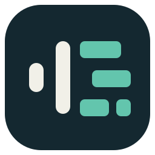

<p align="center"></p>

# ASR2RPP

**ローカルで文字起こし。タイムラインへ書き出し。元の音声はそのまま。**

[English](README.md) · [ダウンロード](https://github.com/zkamiyama/ASR2RPP/releases/latest) · [モデル一覧](docs/models.md)

音声・動画から **REAPERプロジェクト、OpenTimelineIO、再利用できるJSON** を作るアプリです。
背景音除去・時刻の整列・話者ラベルを必要に応じて組み合わせ、同じ認識結果を複数形式へ書き出せます。

## まず試す

1. Releasesから使用するOSの **一式ZIP** を取得し、**新しいフォルダーへ全展開**します。
2. Windowsは `ASR2RPP.exe`、Macは `ASR2RPP.app` を起動します。EXEだけを移動しないでください。
3. 音声をウィンドウへドラッグします。初回は同梱の `examples/sample.wav`、**Whisper Base**、言語 **en**、追加工程OFF、**設定 → 時刻付与 → 自動**で試せます。
4. **GO** を押します。必要なモデルと、未導入ならFFmpegを初回取得します。完了行をダブルクリックすると出力フォルダーが開きます。

自分の録音では言語を音声に合わせてください。標準の出力先は入力ファイルと同じ場所です。歯車が設定、地球ボタンが表示言語の切り替えです。初回取得にはネット接続が必要ですが、取得後の認識で録音をクラウドへ送信することはありません。

## 出力形式を選ぶ

メイン画面の **形式：`RPP ×` `+`** で選びます。**+** は未選択の形式を追加、**×** はその形式を削除します。初期値はRPPだけです。選択は保存され、**何も選ばれていなければエラーダイアログを出し、推論を開始しません。**

| 形式 | 用途 |
|---|---|
| **RPP** | REAPERで開いて編集する。 |
| **OTIO** | OpenTimelineIO対応の編集ソフトや変換アダプターへ渡す。 |
| **JSON** | 生の推論結果、補正後の区間、モデル情報、音源パス、編集タイムラインを保存し、自分の変換処理へ渡す。 |

RPPとOTIOは、全長の参照音声を置いた**ミュート済みORIGINALトラック**と、その下の認識・話者別トラックで構成します。無音の隙間は保ち、同じ話者の区間が重なる場合は追加のレーンへ分けます。音声は**埋め込まず参照**するため、音源も保管してください。

OTIOではトラックとクリップに `enabled=false` を記録します。取り込み先のソフトがこのミュート指定を反映するかは、実際の編集環境で確認してください。

背景音除去で **参照音声 → 処理済み**を選ぶと、連続した `*_vocals.wav` を保存して参照します。原音なら元メディアを参照します。同名の出力は上書きせず連番にします。隣の `.asr2rpp` フォルダーは診断用です。JSONには、そのフォルダーなしでも変換に使える結果データを収録します。**どちらにも認識本文や個人のファイルパスが含まれます。**

[出力の仕様・JSONの読み方・変換例 →](docs/outputs.md)

## モデルと時刻

同梱するのは **20種類のモデル定義**であり、20種類分の重みではありません。選んだモデルだけを取得します。[モデル一覧](docs/models.md)で言語・サイズ・検証範囲を確認できます。同梱のCanary・Moonshineは日本語用ではありません。

時刻の付け方は **設定 → 時刻付与**で選びます。TOMLの編集は不要です。

| 設定 | 動作 |
|---|---|
| **自動** | モデルの時刻があれば使い、なければVAD発話区間を使います。アライメント工程をONにすると整列します。旧TOMLの既定方針も互換のため考慮します。 |
| **モデルの時刻** | ASRが返した区間を使います。時刻を返さないモデルには選べません。 |
| **VAD発話区間** | 声のある区間ごとに認識します。**発話区間であり、単語の境界ではありません。** |
| **強制アライメント** | 認識した文章を音声へ整列します。メイン画面でモデルを選び、長い区間には「アライメント前にVAD分割する」を使います。 |

文字起こし・時刻・話者は誤ることがあります。アライメントは誤認識を訂正する機能ではありません。話者ラベルの付与も、重なった声を別々の音源へ分離する機能とは異なります。

## 必要なもの

| OS | 対応する配布物 | GPU |
|---|---|---|
| **Windows** | x64、AVX2対応CPU | Vulkanのみ。対応するGPUドライバーが必要 |
| **macOS** | Apple Silicon、macOS 14以降。Intel Mac非対応 | Metalのみ |

両OSでCPUも選べます。同梱のReazonSpeech K2ワーカーはCPU専用です。

**同梱**：アプリ用Python、Qt/PySide6、NumPy、safetensors、OpenTimelineIO、whisper.cpp、audio.cpp、CPU版sherpa-onnx。
**初回に別途取得**：選択したモデルの重みと、未導入の場合のFFmpeg。FFmpegはチェックサムを検証し、ユーザー領域へ保存します。手持ちのFFmpegは **設定 → 詳細**で指定できます。
**不要**：Pythonの手動インストール、PyTorch、CUDA Toolkit、Vulkan SDK、Xcode。CUDA・CTranslate2・faster-whisperは標準配布に含めません。

REAPERが必要なのはRPPを開く場合だけです。JSON・OTIOの生成には不要です。Windows版は未署名、Mac版はad-hoc署名済み・未公証です。配布元とチェックサムを確認してください。依存ライブラリ・モデルの条件は本体の[MITライセンス](LICENSE)とは別です。[第三者コンポーネント](THIRD_PARTY.md)にまとめています。

## 自動化・カスタマイズ

```powershell
.\asr2rpp-cli.exe run recording.wav --asr whisper-base --asr-device vulkan --format rpp,otio,json --output-dir exports
.\asr2rpp-cli.exe convert exports\recording.json --format otio --output-dir converted
```

`--format` は繰り返しても指定できます。省略するとRPPだけです。JSONからの再変換ではモデルの取得も推論も行いません。MacのCLIは `ASR2RPP.app/Contents/MacOS/asr2rpp-cli` にあります。[出力・CLIの詳細 →](docs/outputs.md#command-line)

独自モデルは **設定 → 詳細 → 独自TOMLを開く**から、重複しない名前の `.toml` を追加します。署名された `.app` 内部は編集しないでください。GO前に定義を読み直します。**TOMLだけで追加できるのは、導入済み実行環境が対応する構造です。未知のモデル構造には別のruntime/providerが必要です。** [具体例 →](docs/custom-models.ja.md)

停止は **STOP** を押して終了処理を待ちます。GOは待機・停止・失敗した項目を再処理し、完了済みの項目は残します。やり直す場合はキューから削除して追加し直してください。モデル・一時ファイルの保存先は **設定 → 一般**です。更新版は新しいフォルダーへ展開すれば、同じ定義の検証済みモデルを通常は再利用できます。

[モデル一覧](docs/models.md) · [開発・上流更新](docs/development.md) · [出力仕様](docs/outputs.md) · [段階記録](docs/implementation-stages.md)
